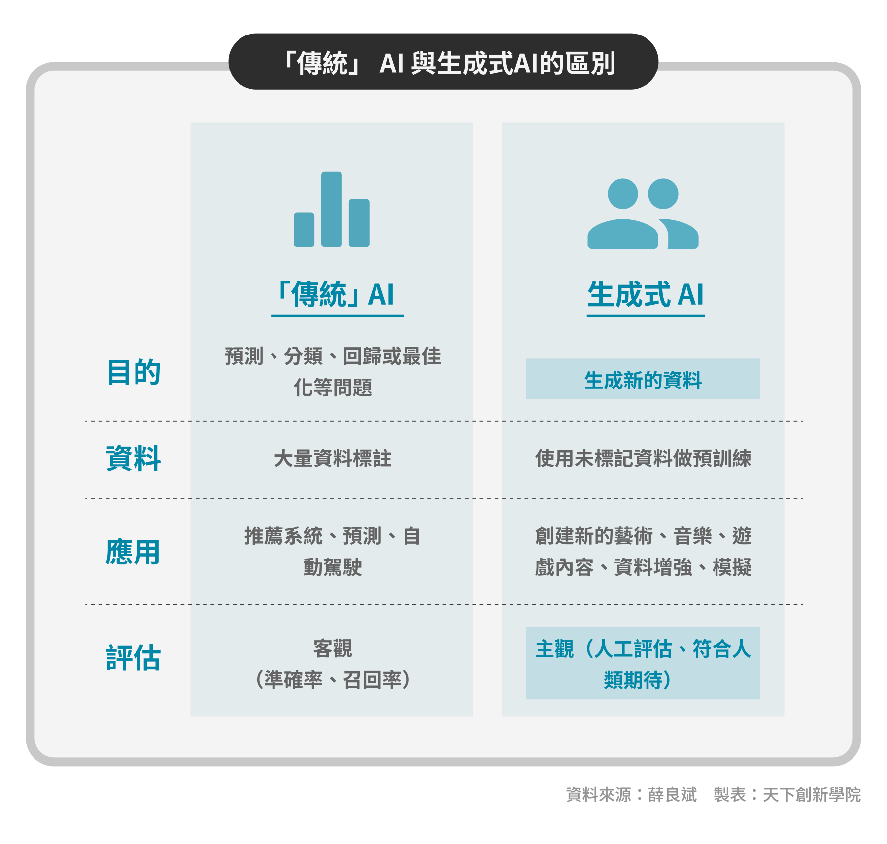

# 測試頁面

我們必須提供一個良好的設計環境供大家使用，

這樣子你可以理解嗎

今年可說是「ChatGpt」元年，生成式AI工具掀起一股旋風，也燃起許多人的焦慮。要如何用得好，讓生成式AI為工作加值？若想要好好運用它，就要先理解生成式AI的本質。生成式AI應用範疇廣泛，只要是能用「一連串資料」表示的資訊，都有可能成為應用對象。

天下創新學院的學習夥伴大家好，我是薛良斌，目前擔任蜂行資本的技術顧問，也是2023年生成式AI年會的議程負責人。

**AI是找到最佳函數，從已知預測未知**

在深入探討生成式 AI 之前，讓我們先討論關於AI的常見迷思。

簡單來說，AI 是一個數學模型，用數學式 Y=F(X)來描述。在這裡，X 是輸入，Y 是輸出，或者我們說是預測結果。

在大家求學階段，一開始遇到數學式的時候，是給你一個已知的F，給你一些X，讓你計算出對應的Y。而我們開發 AI 的目標，則是找到一個最佳的函數F，讓我們能從已知的X預測未知的Y，用已知來預測未來。

所謂的大數據，就是我們針對一個特定的問題，去收集許多的 X 跟 Y，做為模型的訓練資料。

（APP閱讀可點擊圖片放大）

<figure><figcaption></figcaption></figure>

**從魔法到日常的轉變過程**

我有一個涵蓋從魔法、科學、自動化，到日常生活過程的理論。

當我們對某件事物一無所知，不明白其運作機制時，我們往往會稱它為「魔法」。例如，當我們說某樣東西是由 AI 驅動的，對大多數人來說，它就像魔法一樣不可思議。

然而，當我們能夠創造出一個理論來解釋事物如何運作，這件事就轉變為「科學」。這包括數學、物理學、化學，以及研究AI的資料科學。值得注意的是，科學是一個不斷進化的領域，總是在被挑戰、驗證和改進。從古典力學到相對論，再到量子力學，我們不斷地提出新的理論，以更精確地解釋事物的運作。

一旦這些科學原理經過廣泛的驗證和應用，它們便會轉化為「自動化工具」，並逐漸成為我們日常生活的一部分。

舉例來說，家裡的電冰箱、烤箱、微波爐等都是科學的實際應用。你不需要完全理解這些設備背後的科學原理，只需知道如何操作它們，就能享受到它們帶來的便利。又像是使用手機拍照時，內建的AI晶片和演算法會自動調整圖像，即使在低光源環境下也能獲得出色的效果。同樣的，大家也可以使用ChatGPT或是Midjourney等工具，生成令人滿意的文本或圖像。

最後，這些自動化工具會變得如此普遍，以至於它們成為我們「日常生活」的一部分，就像陽光、空氣和水一樣。當我們享受這些基礎設施，例如自來水、電力、網路等帶來的好處時，我們往往會忽略它們的存在。AI 正在朝這個方向發展，逐漸成為我們日常生活中不可或缺的一部分。

**生成式 AI 與「傳統」 AI 的區別**

生成式 AI 是AI的一個專門子領域，專注於使用先進的算法模型來產生文本、圖像、音訊或其他形式的媒體內容。這些模型會從大量的訓練資料中學習內在的模式和結構，進而生成具有相似特性的全新資料。

傳統AI主要針對預測、分類、回歸和最佳化等特定問題。這類 AI 通常需要大量標註過的資料來進行訓練，應用範疇通常包括推薦系統、圖像分類、預測分析和自動駕駛等。

生成式AI的核心目標是「生成新的、原創的資料」。這種 AI 通常先使用大量的未標註資料來源，預先訓練一個基礎模型，然後根據特定的任務或需求進行微調。生成式 AI的應用範疇相當廣泛，包括創造新的藝術作品、生成音樂、開發遊戲內容、資料增強和模擬等。

在評估方面，傳統AI通常可以使用比較客觀的指標，如準確率、召回率、F1分數（F1分數可以看作是模型精確率和召回率的一種調和平均，它的最大值是1，最小值是0）等，來衡量其性能。然而，生成式AI的產出通常較為主觀，因此更依賴人工評估。例如，一個文字摘要或生成的圖像是否成功，往往取決於它是否符合人類使用者的審美和期望。

<figure><figcaption></figcaption></figure>

**生成式 AI 的種類**

除了我們熟悉的文字和圖像，生成式AI的應用範疇其實相當廣泛。只要是能用「一連串資料」來表示的資訊，都有可能成為生成式AI的應用對象。這包括了文字、音訊、影片、3D 模型，甚至是生物資訊如DNA序列、蛋白質和分子結構等。

以「文字生成文字」為例，這種應用可以用於將長篇文章簡化為摘要，或者反過來，根據幾個主要觀點來生成一篇完整的文章、一封信件，甚至是一份簡報。

近期的研究更顯示，不同類型的資料可以進行交叉應用。例如，「圖像與文字描述結合，生成新的影片」，這種應用可以讓你更精確地控制影片的輸出結果。

另一個例子是「文字與聲音的結合，生成新的音頻」，這在語言翻譯或語音拷貝(Voice Cloning)技術上有著廣泛的應用。

**生成式 AI 應用在工作流程中的價值**

生成式 AI 在實際應用中不僅多元，更具有顯著的價值。綜觀其特性，我們可以將其價值大致歸納為以下4個主要方面：

**1.高度靈活性：**\
生成式 AI 不僅限於單一功能。其多樣的基礎模型能夠接受各種形式的輸入資料，並將其轉換成不同類型的輸出，例如：文本生成、語言翻譯，以及問答機制。

**2.即時互動能力：**\
相較於人類，生成式 AI 能夠提供幾乎即時的回應。這不僅提高了用戶體驗，也使得在需要快速決策的情境中，生成式 AI 成為不可或缺的工具。

**3.成本效益：**\
生成式 AI 能夠自動化大量任務，從而提高工作效率。這不僅減少了手動錯誤的可能性，也有助於降低人力和時間成本，使企業或個人能更有效地分配資源。

**4.極高的可拓展性：**\
生成式 AI 模型具有高度的自定義性。開發者和使用者都可以根據特定需求來設定和調整模型參數，這意味著生成式 AI 可以輕易地適應不同的應用場景。

透過這4個方面，我們可以更深入地了解生成式AI的價值，並探討如何將其應用在各種不同的領域中。\
&#x20;

